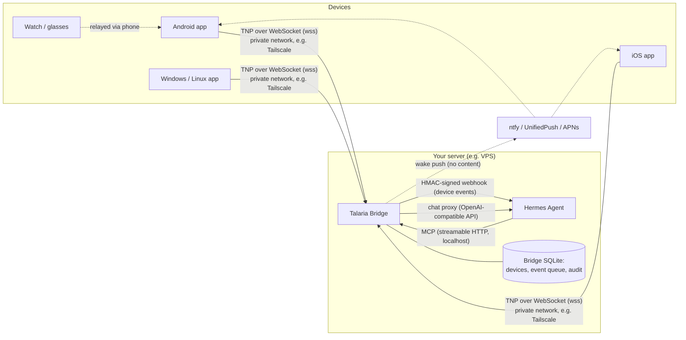
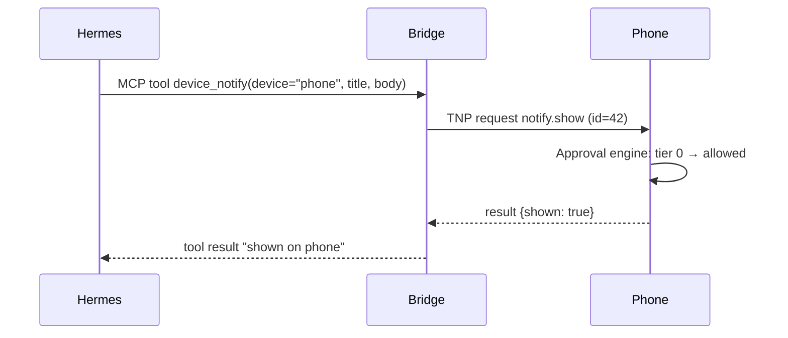
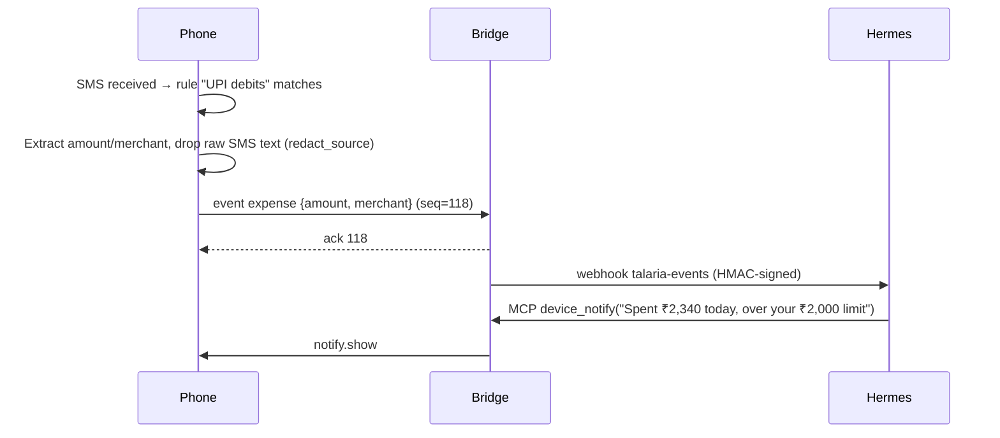
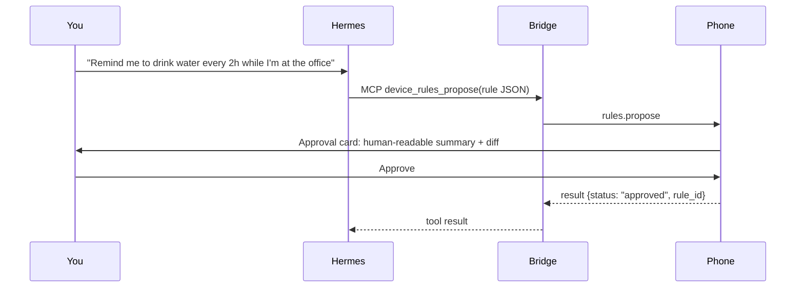
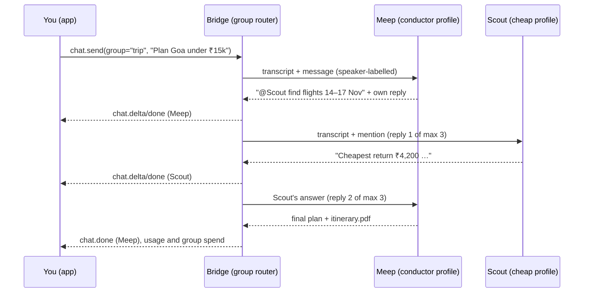
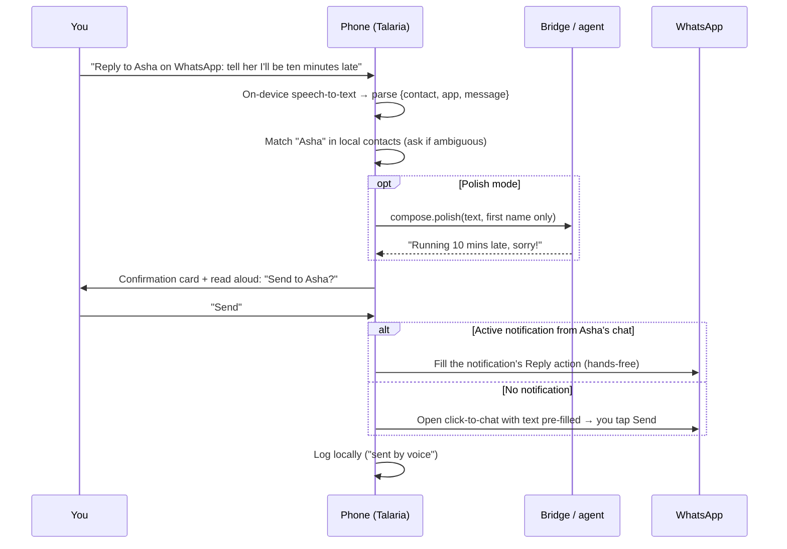

# Architecture (draft v0.1)

## 1. Overview



**The phone senses and acts. The agent thinks. The bridge connects them and enforces nothing the device would not also enforce.**

## 2. Components

### 2.1 Talaria Bridge (server side)

A standalone service that runs on the same host as the agent and listens only on localhost and the private network.

| Responsibility | Detail |
|---|---|
| Device registry | Pairing, device public keys, revocation, last-seen, announced capabilities |
| TNP endpoint | WebSocket server for devices; mutual challenge-response auth (see PROTOCOL §3) |
| MCP server | Exposes a **fixed** set of tools to the agent (see §4) |
| Event pipeline | Receives device events, stores them, forwards selected ones to Hermes via a webhook route |
| Chat proxy | Forwards chat from devices to the right agent's API (Hermes Responses API with named conversations), so **devices never hold agent API keys** |
| Agent registry | Several agents: Hermes profiles (each with its own SOUL.md, memory, model, skills) or other OpenAI-compatible endpoints. Holds endpoints and keys; exposes names, roles, models, modalities, souls. |
| Group router | Agent group chats: routing mode (conductor / @mention / round-robin), speaker-labelled shared context, reply caps, daily budgets |
| Workflow relay | Subscribes to Hermes run events and relays sub-agent (worker) progress and cost to devices |
| Media pipeline | Receives attachments (blobs), checks modality support, forwards to the agent |
| Status | Aggregates bridge, device and per-agent health into one status report |
| Offline queue | Holds TTL-bounded commands (e.g. notifications) for disconnected devices; sends a content-free wake push |
| Audit log | Every command, approval result and event, kept locally |

**Why a standalone bridge rather than a Hermes plugin?**
- **Decoupling.** Hermes moves fast (config schema v49 at the time of writing). MCP and webhooks are stable public interfaces, while plugin internals are not.
- **Agent-agnostic.** The same bridge works with any MCP-capable agent.
- **Blast radius.** A bridge crash does not take down the agent, and the reverse holds too.
- A thin Hermes plugin can be added later for nicer integration (e.g. a device panel in the dashboard), without changing the protocol.

### 2.2 Hermes integration

| Direction | Mechanism | Notes |
|---|---|---|
| Agent → device | Hermes `mcp_servers` entry pointing at the bridge | Tools such as `device_notify` and `device_location` |
| Device → agent (events) | Hermes **webhook adapter** route (`platforms.webhook`) | HMAC-signed. Hermes route `filters`, `coalesce`, `deliver` and `skills` apply. Payload is treated as untrusted. |
| Device → agent (chat) | Hermes **API server** (`127.0.0.1:8642`), Responses API with a named `conversation` per Talaria conversation, via the bridge | The API key stays on the server. Each additional agent (profile) has its own API port and key. |
| Agent souls and info | Bridge reads each profile's `SOUL.md`; model, skills and health via the API server (`/v1/capabilities`, `/v1/skills`, `/health/detailed`) | Writing SOUL.md is opt-in (`allow_soul_edit`) and versioned |
| Sub-agents (workflows) | Hermes `delegate_task` (parallel workers) and Kanban (multi-profile pipelines); progress from the run event stream | Talaria **observes and steers**; it does not orchestrate |

Running cheap workers under a strong conductor is a Hermes setting:

```yaml
# ~/.hermes/config.yaml (conductor profile)
delegation:
  model: "anthropic/claude-haiku-4.5"   # all delegate_task workers use this
  provider: "openrouter"
  max_concurrent_children: 5            # default 10; lower caps cost spikes
```

Choosing a different model **per task** works through profiles: the conductor hands tasks to worker *profiles* (e.g. a cheap "Scout", a strong "Coder") via Kanban.

Example Hermes config (`~/.hermes/config.yaml`):

```yaml
mcp_servers:
  talaria:
    url: "http://127.0.0.1:8770/mcp"
    headers:
      Authorization: "Bearer ${TALARIA_MCP_TOKEN}"

platforms:
  webhook:
    enabled: true
    extra:
      port: 8644
      routes:
        talaria-events:
          secret: "${TALARIA_WEBHOOK_SECRET}"
          events: ["expense", "geofence", "notification_digest"]
          prompt: |
            Event from device {device.name} ({event.type}):
            {event.payload}
          coalesce:
            key: "device.id"
            window_seconds: 30
          deliver: "log"   # or telegram, etc.; replies normally go back via device_notify
```

### 2.3 Clients (Kotlin Multiplatform + Compose Multiplatform)

```
client/
├── core/
│   ├── protocol/      # TNP codec, session state machine, reconnect, acks   (common)
│   ├── security/      # key mgmt interface, signing, approval engine         (common + expect/actual)
│   ├── rules/         # rule DSL, evaluator, template expansion, script host (common)
│   ├── storage/       # encrypted local DB (rules, history, event outbox)    (common, SQLDelight)
│   ├── capabilities/  # Capability interface + registry                      (common)
│   ├── voice/         # SpeechToText + TextToSpeech interfaces               (common + expect/actual)
│   ├── replies/       # voice replies: intent parsing, local contact match, delivery routes (common + actual)
│   └── media/         # image downscale, EXIF/GPS strip, PDF page picking    (common + expect/actual)
├── capability-impl/
│   ├── android/       # notifications listener, SMS, geofence, camera, TTS, foreground service
│   ├── desktop/       # toasts, script runner, folder watch, hotkey, tray   (JVM: Windows/Linux)
│   └── ios/           # APNs, CoreLocation regions, App Intents            (later)
├── ui/                # Compose Multiplatform screens: chat, approvals, rules, devices, settings
└── apps/
    ├── androidApp/
    ├── desktopApp/
    └── iosApp/
```

- **Capabilities are plugins inside the app.** Each implements `Capability` (name, version, tier, params schema, `invoke()`), registers itself only if the OS allows it, and is announced to the bridge on connect. The protocol never assumes a capability exists.
- **Approval engine** (in `core/security`) sits between the session and every capability call. It cannot be bypassed by protocol messages.
- **Outbox pattern.** Events are written to the local DB first, then sent, and removed only after the bridge acknowledges them. Nothing is lost when offline.
- **Voice is local.** `SpeechToText` is an interface with swappable engines: Android's on-device `SpeechRecognizer` first (free, streaming partial results, en-IN/hi-IN), whisper.cpp on-device later (offline, better with mixed languages). The transcript lands in the input box for editing before it is sent; auto-send is optional. Replies can be spoken with the platform TTS (free).
- **Media is prepared on the device.** Images are downscaled (long edge ≤ 1568 px, enough for Claude vision) and location metadata is stripped before upload. Long PDFs prompt for a page range.

### 2.4 Wake path

Mobile OSes kill idle sockets. When a TTL command is queued for a disconnected device, the bridge sends a **content-free wake push**: ntfy/UnifiedPush on Android (no Google dependency), and APNs on iOS (needs a relay holding Apple credentials; see ROADMAP M7). The device reconnects and pulls its queue. **No payload ever travels through the push provider.**

## 3. Key data flows

### 3.1 Agent sends a notification



### 3.2 SMS triggers a rule, which informs the agent



### 3.3 Agent proposes a rule (plain language → rule)



### 3.4 Group chat turn (conductor routing)



### 3.5 Multimodal routing

| Input | Path | Notes |
|---|---|---|
| Photo / screenshot | Device downscales and strips GPS → blob → agent | Claude models read images directly |
| PDF | Blob → agent | Claude reads text and layout; cost scales with pages |
| Voice | On-device speech-to-text → text | No audio leaves the device by default |
| Audio file | On-device or server transcription → text | Opt-in |
| Video | Sampled frames → images, plus transcribed audio | Sample sparingly; cost adds up |
| Image generation (output) | Agent's image tool (e.g. an OpenRouter or FAL image model) → blob → chat | Needs an image provider configured in Hermes |
| Files (output) | Agent writes in its sandbox → blob → downloadable card | — |

If the selected agent lacks a modality, the client warns, or the conductor delegates that part to a capable worker. Hermes can also use a separate (cheaper) model for its auxiliary vision tasks.

### 3.6 Voice reply to another app



**Delivery routes, in order of preference**

| Route | When | Hands-free | Notes |
|---|---|---|---|
| Notification **Reply** action | The target chat has an active notification | ✅ | The same public Android mechanism Android Auto and Wear OS use: the app's own reply action, filled with your dictated text. Needs notification access (M8). |
| SMS send | Target is an SMS contact | ✅ | Needs SMS permission (sideloaded build) |
| Click-to-chat pre-fill (WhatsApp `wa.me`, Telegram share) | No notification | One tap | Fully official; you press Send in the real app |
| Telegram Business bot | Telegram, within 24 h of the contact's last message | ✅ | Official "reply as you" route |
| Accessibility auto-tap | Opt-in only | ✅ | Fragile; off by default and not recommended |
| Talaria agents / groups | Target is an agent or group | ✅ | Native `chat.send` |

## 4. The agent-facing MCP surface (fixed)

The tool list is **fixed and independent of which devices are connected**. In Hermes, changing the tool set invalidates the provider prompt cache, so dynamic per-device tools would make every turn more expensive.

| Tool | Purpose |
|---|---|
| `devices_list` | Connected devices, their names and announced capabilities |
| `device_notify` | Show a notification (title, body, channel, actions, TTL) |
| `device_speak` | Text-to-speech on a device |
| `device_location` | Current location (coarse by default) |
| `device_recent_notifications` | Recent forwarded notifications (allow-listed apps only, already redacted) |
| `device_events_query` | Query stored device events (by type and time range) |
| `device_run_script` | Run a **pre-registered** script by name with typed arguments (desktop) |
| `device_rules_propose` | Propose a rule. It always requires on-device approval. |
| `device_call` | Generic call for any announced capability (escape hatch; subject to the same tiers) |

## 5. Storage

| Where | What | Protection |
|---|---|---|
| Bridge SQLite | Devices, public keys, event store (retention configurable, default 30 days), offline queue, audit log, groups and group transcripts, soul version history, spend counters | File permissions 0600. Optional SQLCipher. |
| Bridge config | Agent registry (`agents.yaml`: endpoints, keys via env vars, roles, modalities, cost tiers) | Mode 0600; keys never sent to devices |
| Device DB | Rules, chat history cache, event outbox, approval history | SQLCipher, key wrapped by OS keystore |
| Device keystore | Device private key (ECDSA P-256) | Android Keystore (StrongBox if available), Secure Enclave, Windows CNG/TPM, Linux Secret Service |

## 6. Tech stack

| Area | Choice | Why |
|---|---|---|
| Bridge | Python 3.12+, `websockets`/Starlette, official `mcp` Python SDK, SQLite | Same ecosystem as Hermes; simple to self-host |
| Clients | Kotlin Multiplatform, Compose Multiplatform, Ktor client, SQLDelight | Native Android power plus shared logic and UI on desktop and iOS |
| Scripting (rules) | Embedded JS engine (e.g. QuickJS via a KMP binding), sandboxed | Small and safe; no file or network access except declared actions |
| Network | Tailscale recommended (`tailscale serve` provides HTTPS) | No public ports; WireGuard encryption; real TLS certificates |
| Distribution | GitHub Releases, F-Droid, Obtainium (Android); MSI/EXE, DEB/RPM (desktop) | Avoids Play Store restrictions on SMS and notification access |
| CI | GitHub Actions (Linux for Android/desktop, macOS runners for iOS; free for public repos) | Builds without a local Mac |

## 7. Repository layout

```
talaria/
├── spec/        # PROTOCOL.md source of truth + JSON Schemas + conformance test vectors
├── bridge/      # Python bridge (MCP server, TNP server, CLI: talaria pair|devices|logs)
├── client/      # KMP client (see §2.3)
├── tools/
│   └── tnp-cli/ # reference test client: pair and exercise the protocol from a terminal
└── docs/
```

## 8. Open questions

Decided: **chat goes through the bridge** (devices hold no agent keys; one credential per device).

1. **Event delivery to Hermes:** webhook-per-event (current plan) or a Hermes plugin that injects events into an existing session?
2. **Relay for iOS push:** self-hosted relay with the user's own Apple account, or skip background push on iOS?
3. **Rule engine scope:** how far beyond trigger → action do we go (loops, variables) before it becomes a programming language?
4. **Per-task worker models:** is Kanban across profiles enough, or should the conductor be able to pick a model per `delegate_task` call (needs Hermes support)?
5. **Soul editing:** keep it bridge-opt-in only, or also require confirming on the terminal?
6. **Group transcript retention** and whether group context should be summarised to control cost in long-running groups.
7. **Name:** "Talaria" is a placeholder. Check trademarks before 1.0.
